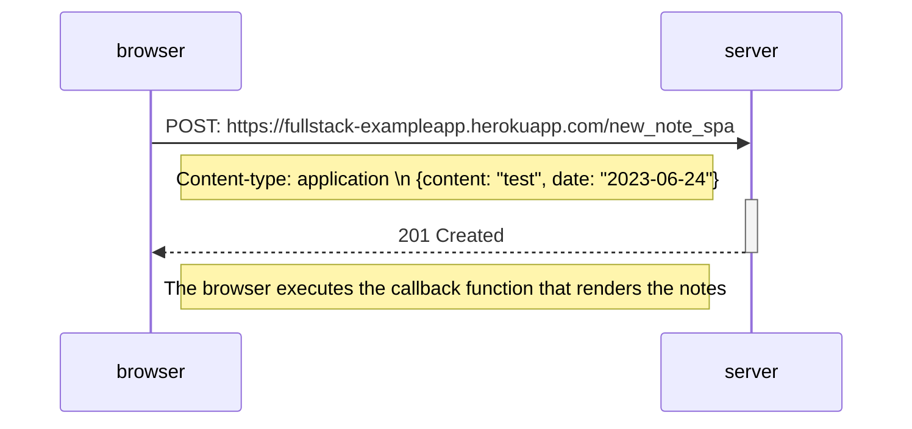

```mermaid
sequenceDiagram
    participant browser
    participant server

    browser->>server: POST: https://fullstack-exampleapp.herokuapp.com/new_note_spa
    Note right of browser: Content-type: application \n {content: "test", date: "2023-06-24"}
    activate server
    server-->>browser: 201 Created
    deactivate server

    Note right of browser: The browser executes the callback function that renders the notes

```

